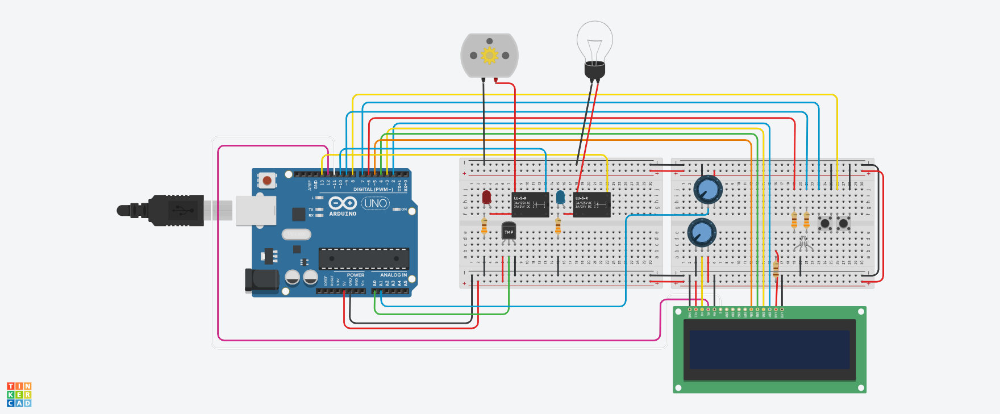
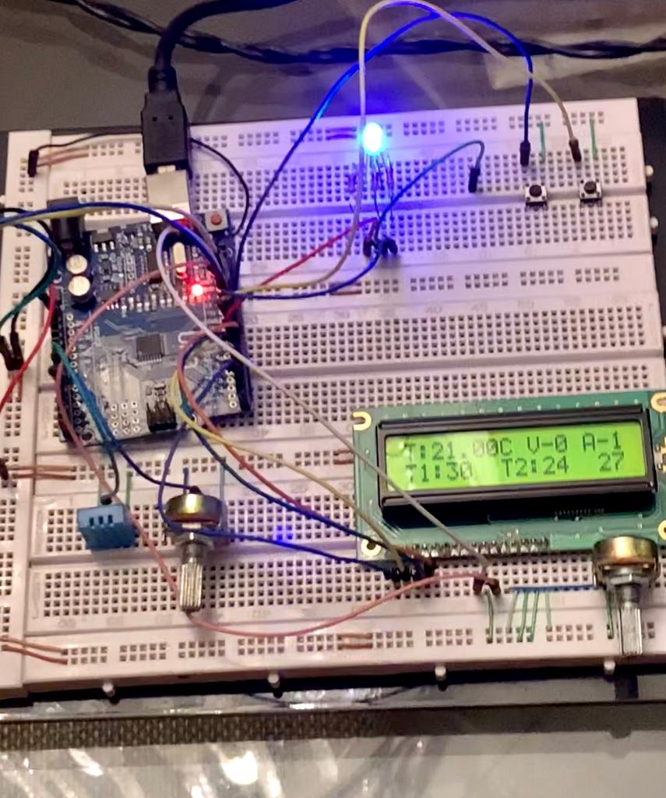

<h1 align="center">
   
  Projeto Sensor Temperatura Tinkercad
</h1>
<h1 align="center">
   
  Projeto Sensor Temperatura Arduino
</h1>

  
  

 

### Projeto

Projeto desenvolvido na aula de Sistemas Embarcados, na Universidade Positivo, sob comando do professor Dr Edras Pacola. Primeiramente, teste todos os componentes no [Tinkercad](https://www.tinkercad.com/). Depois de testado, criei o circuito real no arduino. 

Feito com ❤️ por Larissa Iurk
